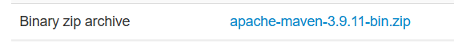

Phiên bản JavaFX: 25

Phiên bản Maven: 3.9.11
Cách tải: https://maven.apache.org/install.html

Hnhu IDE của ae tự nhận dạng project Maven
chạy `mvn clean compile` 1 lần trong IDE, hoặc cd vào file project r chạy

`mvn javafx:run` để chạy game

App.java để khởi tạo cửa sổ, StackPane Canvas, GameEngine

GameEngine là lớp quản lí logic game
